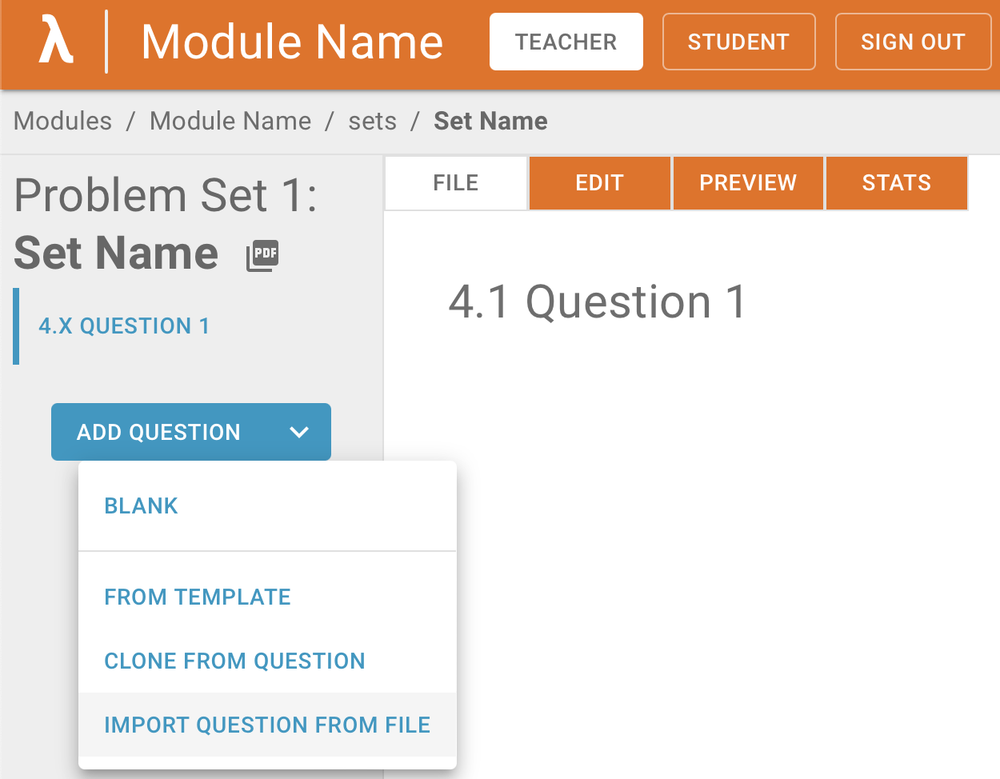

# 🚀 Quickstart

This page gives a quick overview of how to get started with tex2lambda to quickly add documents to Lambda Feedback.

## 1. Installation

[](https://pypi.org/project/tex2lambda/)
[](https://pypi.org/project/tex2lambda/)


:::{important}
Ensure that [pandoc](https://pandoc.org/installing.html) is already installed.
:::

tex2lambda can be installed via [pip](https://pip.pypa.io/en/stable/):

```shell
$ pip install tex2lambda
$ tex2lambda --help
```

This can also be done through [pipx](https://pypa.github.io/pipx/).

## 2. Choose a Document

tex2lambda takes in two arguments:

- The path to a document.
- A filter describing how to parse it.

A list of available filters can be found [here](filters/index).

For instance, the following takes in `questions.tex` and uses a filter that expects [each part to be directly followed by the solution](filters/_autosummary/PartSolPartSol):

```bash
$ tex2lambda questions.tex PartSolPartSol
```

:::{note}
The filter name is case-insensitive. Don't worry about the capital letters.
:::

Another filter might be used if [the answers are in a separate file](filters/_autosummary/PartsSepSol):

```bash
$ tex2lambda questions.tex --answers solutions.tex PartsSepSol
```

By default, this generates an `out` directory in the same place that the command was run in. It contains the zipped question files.

Check the [command line tool reference](reference/command-line) for more information.

## 3. Import into Lambda Feedback

Click on a set in teacher mode. The arrow next to the "Add Question" button allows you to import a question from a file.

Choose the zip file you wish to upload, and the question should appear! 🎉


