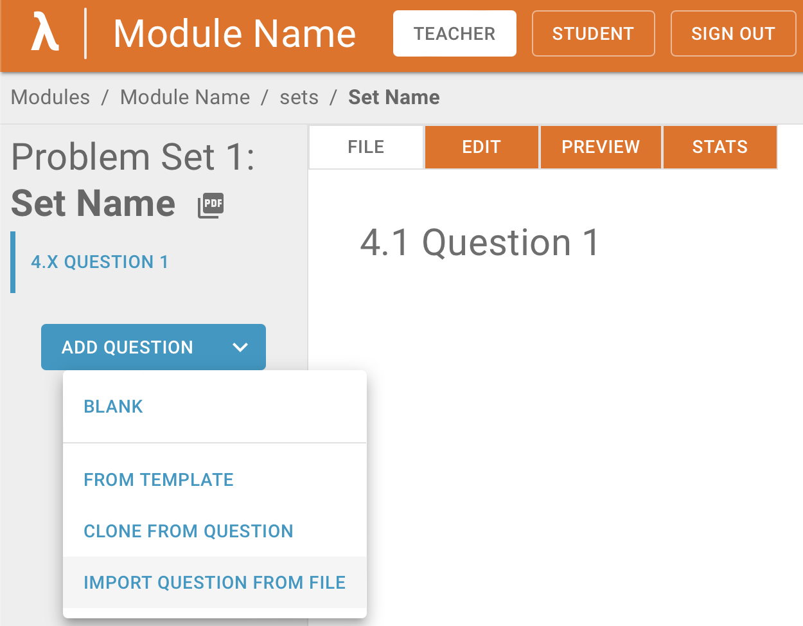

# 🚀 Quickstart

This page gives a quick overview of how to get started with in2lambda to quickly add documents to Lambda Feedback.

## 1. Installation

### Docker

[](https://github.com/lambda-feedback/in2lambda/pkgs/container/in2lambda)

The following creates an interactive container which includes in2lambda and mounts the current working directory into `/files`:

```bash
$ docker run -it --rm -v $(pwd):/files ghcr.io/lambda-feedback/in2lambda sh
```

Within the container, we can access the files and run in2lambda as normal.

```bash
$ cd files
$ in2lambda --help
$ ...
$ exit
```

The container is stopped and deleted after exiting, although the image remains downloaded for future use.

### PyPi

[](https://pypi.org/project/in2lambda/)
[](https://pypi.org/project/in2lambda/)


in2lambda can be installed via [pip](https://pip.pypa.io/en/stable/). To author questions in Python:

```shell
$ pip install in2lambda
```

To convert documents, install the `convert` extra and [pandoc](https://pandoc.org/installing.html):

```shell
$ pip install 'in2lambda[convert]'
$ in2lambda --help
```

This can also be done through [pipx](https://pypa.github.io/pipx/).

## 2. Choose a Document

`in2lambda convert` takes in two arguments:

- The path to a document.
- A filter describing how to parse it.

A list of available filters can be found [here](filters/index).

For instance, the following takes in `questions.tex` and uses a filter that expects [each part to be directly followed by the solution](filters/_autosummary/PartSolPartSol):

```bash
$ in2lambda convert questions.tex PartSolPartSol
```

:::{note}
The filter name is case-insensitive. Don't worry about the capital letters.
:::

Another filter might be used if [the answers are in a separate file](filters/_autosummary/PartsSepSol):

```bash
$ in2lambda convert questions.tex -a solutions.tex PartsSepSol
```

By default, this generates an `out` directory in the same place that the command was run in. It contains the zipped question files.

Before writing anything, in2lambda prints the problems it can detect that would stop the set importing or make it render wrongly — an answer that doesn't fit the box marking it, a figure the export won't contain, maths that KaTeX can't display. Each names the question, part and field to go and look at. They are warnings rather than errors: the `out` directory is written either way, since a problem found here may well be deliberate.

The maths is checked by rendering it with KaTeX itself, the way Lambda Feedback will, which needs [Node.js](https://nodejs.org) installed. Without Node.js everything else is still checked and in2lambda says the maths was not.

Check the [command line tool reference](reference/command-line) for more information.

## 3. Import into Lambda Feedback

Click on a set in teacher mode. The arrow next to the "Add Question" button allows you to import a question from a file.

Choose the zip file you wish to upload, and the question should appear! 🎉

Imported questions arrive published with every display setting on, and the set's own visibility settings still apply. The Python API can set each of these per question — see the
[question format](question-format).


